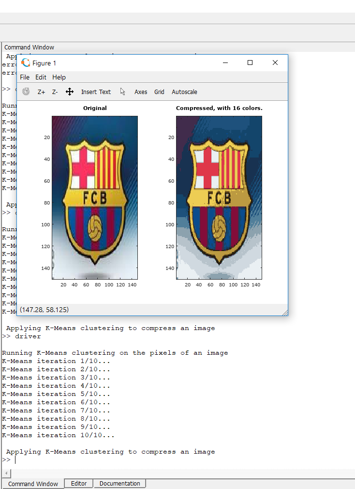

# imagecompress
Using K-Means clustering to compress an image

The program, written in MATLAB uses the imread function to read a hardcoded image. It then reduces it's parameters to a range from 0 to 1 
and proceeds to run K-Means on each pixel of the image and then assigns each pixel to its closest centroid. We initialize K and the number
of iterations that we want

Image courtesy : www.fcbarcelona.com
